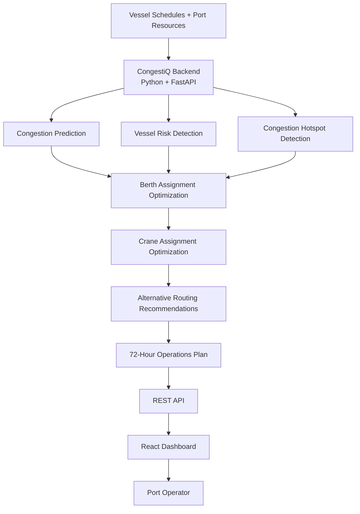

# Solution Overview

## What We Built

CongestiQ is an AI-powered port operations decision-support system designed to help port operators predict congestion, identify high-risk vessels and congestion hotspots, optimize berth and crane assignments, recommend alternative routing actions, and generate a prioritized 72-hour operations plan.
The system uses simulated vessel schedules and port resource data to demonstrate how congestion risks can be detected early and converted into operational recommendations.

## How It Works

1. Vessel schedules, berth capacity, crane availability, and operational data are loaded into the system.
2. The backend analyzes vessel schedules and port capacity to calculate vessel congestion-risk scores.
3. CongestiQ calculates a port-wide congestion score and identifies contributing factors such as berth utilization, arrival density, crane availability, and delay pressure.
4. The system identifies congestion hotspots by analyzing vessel overlap and berth pressure.
5. Berth and crane assignment optimizers evaluate vessel schedules and recommend suitable resource assignments.
6. For vessels with significant congestion risk, the system generates alternative operational routing recommendations such as speed reduction, anchor-and-wait, and terminal transfer.
7. The system combines the prediction, hotspot, risk, optimization, and routing results into a prioritized 72-hour operations plan.
8. The React dashboard displays the results so port operators can understand risks and recommended actions from a single interface.

## Architecture Diagram

## Architecture Diagram



### But for draw.io

In **draw.io**, you paste **only the part starting from**:

```text
flowchart TD
through:

K --> L["Port Operator"]
```

## Key Design Decisions

| Decision | Rationale |
|---|---|
| Separate React frontend and FastAPI backend | Keeps the user interface separate from the application logic and APIs. |
| Vessel risk scoring | Helps operators identify vessels that require immediate attention. |
| 72-hour prediction horizon | Gives port operators a forward-looking planning window. |
| Congestion hotspot detection | Identifies areas where vessel overlap and berth pressure may create congestion. |
| Berth assignment optimization | Recommends suitable berth assignments while considering vessel and berth constraints. |
| Crane assignment optimization | Matches vessel crane requirements with available crane resources. |
| Alternative routing recommendations | Provides operational options for vessels affected by congestion. |
| Prioritized 72-hour plan | Converts prediction and optimization results into actionable priorities. |
| Simulated operational data | Allows the prototype to demonstrate the complete workflow without claiming live port data. |


## IBM Technologies Used
IBM Bob

IBM Bob was used as the AI-powered development environment for building CongestiQ. It was used to create and develop the project structure, backend services, API endpoints, prediction and optimization logic, React frontend pages, tests, and supporting documentation.

The completed application was tested locally through the FastAPI backend and React dashboard.

Technology Stack

| Layer | Technology |
|---|---|
| Frontend | React + Vite |
| Backend | Python + FastAPI |
| Database | SQLite for local development; PostgreSQL supported |
| API | REST API + OpenAPI/Swagger |
| Development Environment | IBM Bob |